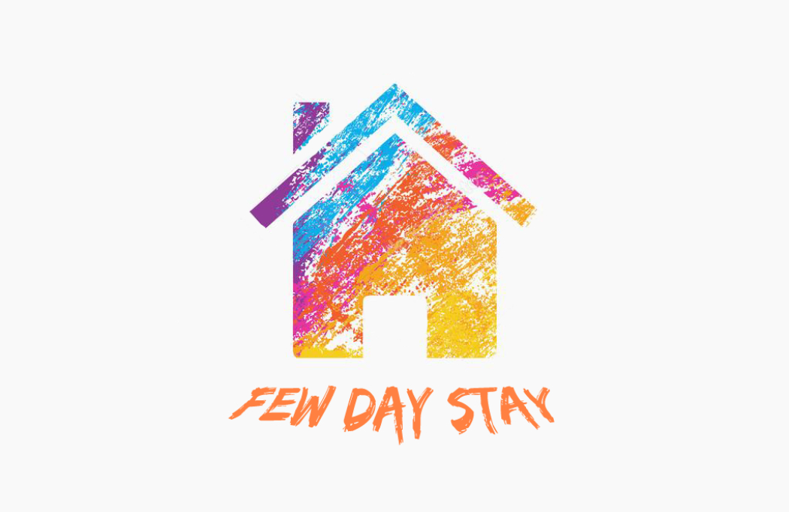

# Grupa1-OMGSestre [FewDayStay](https://fewdaystay.azurewebsites.net)

## Tema: Few day stay

**Članovi tima**:
1. [Nadija Borovina](https://github.com/lizardqueen98)
2. [Jasmin Bajrić](https://github.com/jbajric)
3. [Nedžad Hadžiosmanović](https://github.com/nhadziosma1)

### Opis teme
- Putnici više neće morati brinuti da li će naći prostor u kojem će prenoćiti ukoliko se odluče za iznenadni put, jer sve što će im trebati je aplikacija “Few day stay”. Kroz nju će putnik moći naći prostor koji najbolje odgovara njegovim potrebama i ograničenjima, uz pomoć mnogobrojnih filtera koje nudi ova aplikacija. Proces rezervisanja će biti brz i jednostavan. Da bi poboljšali iskustvo naših korisnika, aplikacija ima opciju pomoću koje nakon vremena provedenog u nekom prostoru ocjenjuju isti. Aplikacija je također namijenjena i za ljude koje žele iznajmiti svoj prostor. Iznajmljivanje prostora se vrši prebacivanjem korisničkog profila u tzv. “vlasnik mode”(vlasnik režim rada) koji nastupa dopunom određenih informacija te dodavanjem barem jednog objekta za iznajmljivanje. “Vlasnik mode” ne ograničava korisnika da koristi pogodnosti aplikacije kao i običan putnik.

### Procesi
- Korisnik kreira vlastiti račun, pri čemu unosi: ime, prezime, password, e-mail, spol i datum rođenja, adresu prebivališta.

- Korisniku je omogućen pregled svih dostupnih objekata objavljenih na stranici za iznajmljivanje.

- Korisniku je omogućen izbor filtera kao što su pregled po cijeni, imenu, gradu, vlasniku, broju kreveta... da bi mogao suziti izbor objekata koji mu odgovaraju. 

- Korisniku je omogućen proces iznajmljivanja prostora za određeni datum/datume ili  povratna informacija da je on zauzet u željenom periodu.

- Korisnik ima mogućnost ocjenjivanja prostora u kojem je odsjeo nakon što je njegov boravak u istom okončan.

- Korisnik ima mogućnost postati vlasnik, uz objavljivanje minimalno jednog objekta koje želi postaviti na stranicu.

- Vlasnik ima pravo učiniti neke datume nedostupnim za iznajmljivanje ukoliko iz nekog razloga nije u stanju ili ne želi u određenom periodu svoj prostor učiniti dostupnim.

- Vlasnik kao i korisnik imaju mogućnost pregleda ocjena svih objekata.

- Vlasnik ima mogućnost uklanjanja/brisanja nekog objekta sa stranice ukoliko više ne želi iz nekoga razloga da ga iznajmljuje.

- Vlasnik ima mogućnost ažuriranja objekta, koji je već objavio kao i dodavanja novih.

- Vlasnik je ujedno i korisnik i ima sve privilegije korisnika prelaskom u korisnik režim rada.

### Funkcionalnosti
- Mogućnost kreiranja i ažuriranja korisničkog računa

- Mogućnost pretrage za odgovarajućim prostorom

- Mogućnost ocjenjivanja prostora

- Mogućnost prebacivanja svog korisničkog računa u “vlasnik mode” i obratno

- Mogućnost kreiranja , ažuriranja objekata i brisanja objekta

- Mogućnost pregleda detalja o objektu, kako za vlasnika tako i za korisnike

### Akteri
- Korisnik usluga, tj. putnik – osoba koja ima mogućnost tražiti prostore registrovane na stranici, te nakon njihove upotrebe ih ocjenjivati

- Vlasnik objekta – osoba koja iznajmljuje svoj/svoje objekat/objekte, ujedno je i korisnik
